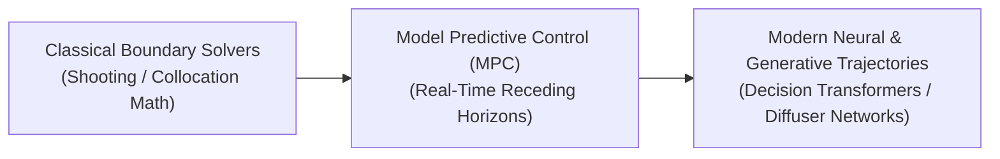

# Awesome-Trajectory-Optimization
## Trajectory Optimization in AI: Evolution, Variants, Types, & Applications

Trajectory Optimization is a foundational computational framework in artificial intelligence, robotics, and reinforcement learning (RL). It focuses on finding a sequence of control inputs and system states (a trajectory) that minimizes a specified cost function (such as energy consumption or travel time) while satisfying physical, environmental, and system constraints. In AI, trajectory optimization bridges the gap between high-level behavioral planning and low-level physical execution, transforming abstract strategic goals into precise, safe, and dynamically feasible physical trajectories.

---

## 1. The Chronological Evolution

The development of trajectory calculation has transitioned from classical numerical physics solvers to data-driven neural policy guides and multi-horizon generative transformer models.

*   **The Classical Numerical Solvers Era (Pre-Deep Learning)**
    *   *Concept:* Rooted in traditional optimal control theory and numerical optimal control. Standard methodologies focused on solving explicit differential equations using mathematical pipelines like **Direct Transcription**, **Collocation**, or **Shooting Methods**.
    *   *Limitation:* Required a completely perfect, explicit analytical physics model of the system. These setups were highly latent, prone to getting stuck in local minima, and struggled with complex, high-dimensional spaces like soft robotics.
*   **The Real-Time Receding Horizon Era (Model Predictive Control / MPC, ~2010s)**
    *   *Concept:* Shifted from calculating a static global path beforehand to continuously resolving trajectory chunks online. By solving an optimization problem over a short, finite future horizon, executing the very first step, and immediately re-solving with updated physical tracking data, MPC introduced robust feedback loops.
    *   *Limitation:* Limited by the available on-board computer hardware clock speed, forcing developers to simplify the system's mathematical physics models to keep calculations fast.
*   **The Deep Neural & Generative Sequence Era (~2020s–Present)**
    *   *Concept:* The current modern state-of-the-art framework. Trajectory optimization merged with generative deep learning. Architectures like **Decision Transformers** and **Diffusion Policy / Diffuser Networks** reframe trajectory planning as a generative sequence modeling task. Instead of executing step-by-step calculus loops, the network treats path generation exactly like text completion or image denoising, outputting multi-horizon, fluid trajectories instantly.

---

## 2. Core Functional & Transcription Variants

Trajectory optimization frameworks are strictly categorized based on how the underlying mathematical state and control dimensions are discretized and handled across time intervals.

*   **Indirect Methods (Optimality Conditions)**
    *   *Mechanism:* Uses Calculus of Variations and *Pontryagin’s Minimum Principle* to convert the trajectory problem into a complex system of boundary value problems, solving for theoretical optimality conditions first.
    *   *Pros:* Provides highly exact mathematical solutions, but is notoriously difficult to initialize and fails when encountering non-smooth environmental limits (like sudden physical collisions).
*   **Direct Shooting Methods**
    *   *Mechanism:* Discretizes *only* the control variables over a sequence of time blocks. The algorithm parameterizes the inputs, uses a simulator to step the physics forward ("shoots" the trajectory), checks the terminal errors, and optimizes the control parameters iteratively.
*   **Direct Collocation / Transcription Methods**
    *   *Mechanism:* Discretizes *both* the system states and the control variables simultaneously across a fine chronological grid. The optimization engine treats the physical equations of motion as individual structural equality constraints at every single grid node (collocation point).
    *   *Pros:* Easily handles highly intricate path limitations (such as absolute obstacle avoidance boundaries), making it the primary engineering baseline for autonomous systems.

---

## 3. Deep Learning & Reinforcement Learning Integrations

Modern artificial intelligence pipelines utilize distinct architectural layers to accelerate trajectory generation or guide neural exploration.

*   **Model-Based Reinforcement Learning (MBRL / Trajectory Rollouts)**
    *   *Mechanism:* The AI system trains a deep neural network to act as a **World Model**, learning the transition physics of the environment from raw interaction logs. It then runs imaginary trajectory rollouts inside its hidden layers to optimize its policy network without risking physical damage.
    *   *Examples:* World Models, DreamerV3, and MuZero.
*   **Diffusion-Based Trajectory Policy (Diffuser)**
    *   *Mechanism:* Replicates image diffusion. It initializes a trajectory path as pure, random Gaussian noise vectors over a fixed sequence window. It then iteratively removes noise tokens over a series of steps, molding the random array into a globally optimal, obstacle-free trajectory path matching a targeted final reward constraint.
*   **Guided Policy Search (GPS)**
    *   *Mechanism:* Uses classical trajectory optimization (like Differential Dynamic Programming - DDP) to discover high-quality localized trajectory paths, utilizing those trajectories as precise supervised demonstrations to rapidly train a deep, global neural network policy.

---

## 4. Production Engineering Challenges & Mitigations

Executing trajectory calculations across real-world physical boundaries and low-latency control loops introduces critical computational and safety constraints.

*   **The Local Minima and Obstacle Explosion Barrier**
    *   *The Problem:* When an autonomous system maps a complex architectural space containing hundreds of moving obstacles, the mathematical cost function becomes highly non-convex. Traditional optimization engines frequently get trapped in sub-optimal local minima, causing the system to freeze or fail.
    *   *Mitigation:* Implementing **Neural Warm-Starting**. A deep convolutional network or vision-language model evaluates the scene context first, instantly outputting a near-optimal candidate path array to seed the numerical solver, bypassing the exploration loop.
*   **The High-Frequency Inference Latency Bottleneck**
    *   *The Problem:* Safety-critical physical systems (like an autonomous vehicle correcting for a tyre slip) require control loops running at speeds exceeding $100\text{ Hz}$ to $1000\text{ Hz}$. Standard deep generative models can introduce processing latencies that stall execution rates.
    *   *Mitigation:* Running **Actor-Critic Distillation Frameworks**. Complex multi-horizon trajectory generation is calculated on powerful edge chips or server nodes, distilling the optimal output trajectories down into highly compact, single-turn student networks running on fast microcontrollers.

---

## 5. Frontier Real-World AI Applications

*   **Autonomous Vehicle Obstacle Avoidance & Path Replanning**
    *   *Application:* Coordinates active driving paths for autonomous consumer vehicles or long-haul trucks. Trajectory optimization modules ingest streaming lidar and computer vision tokens, calculating safe lane changes and collision avoidance curves at high speeds to manage dynamic highway traffic boundaries smoothly.
*   **Spatio-Temporal Control for Bipedal Humanoid Robotics**
    *   *Application:* Drives real-time locomotion stacks for advanced bipedal and quadrupedal robots. Trajectory engines map out target center-of-mass vectors and foot placement coordinate timelines, calculating precise joint torque adjustments to help the machine cross uneven, volatile debris fields stably.
*   **Next-Generation Rocketry & Aerospace Guidance Loops**
    *   *Application:* Directs vertical landing maneuvers for reusable orbital booster rockets or orbital station-keeping systems. Real-time trajectory optimization solvers continuously evaluate shifting wind shears, fuel weight decay rates, and telemetry variations, updating aerodynamic grid-fin parameters dynamically to achieve pinpoint landing accuracy.

