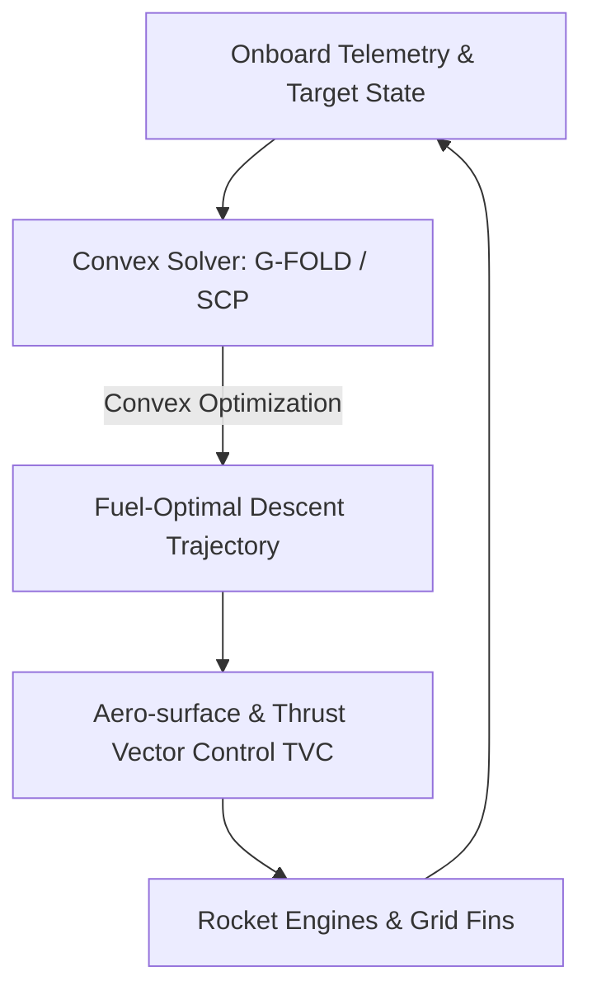

# Next-Generation Rocketry & Aerospace Guidance Loops 🚀

Aerospace trajectory optimization guides reusable launch vehicles during high-velocity powered descent phase, meeting pinpoint landing precision while conserving fuel.

## 📋 Core Concepts

Powered descent guidance (PDG) is highly non-convex due to aerodynamics, thrust pointing boundaries, and terrain safety constraints. 

### Lossless Convexification
Seminal research introduced **lossless convexification**, which mathematically transforms the non-convex constraints (e.g. minimum thrust limits, thrust pointing angles) into a convex representation. 

This formulation guarantees that solving the convex problem yields the exact, globally optimal solution to the original non-convex optimal control problem. This allowed real-time, onboard trajectory optimization solvers (such as JPL's **G-FOLD** algorithm) to run reliably during flight.

---

## 📊 Guidance Pipeline

---

## 📚 References
- Açıkmeşe, B., & Ploen, S. R. (2007). *Convex Programming Approach to Powered Descent Guidance for Mars Landing*. Journal of Guidance, Control, and Dynamics. [AIAA Link](https://arc.aiaa.org/doi/10.2514/1.27350)
