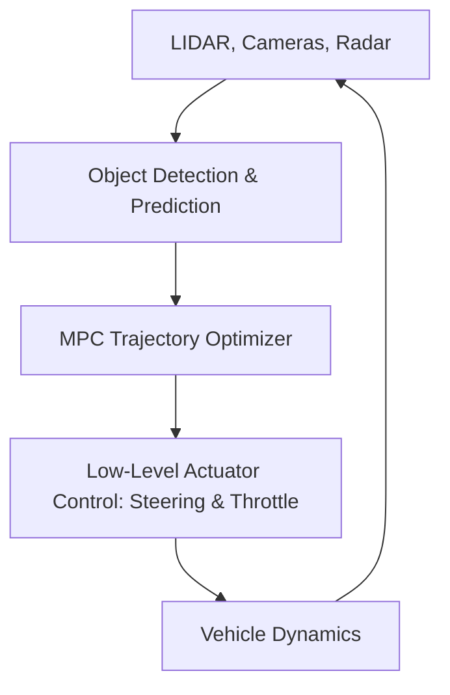

# Autonomous Vehicle Obstacle Avoidance & Path Replanning 🚗

Trajectory optimization in autonomous vehicles coordinates safe, dynamic driving paths in real-time, handling lane changes, passenger comfort, and sudden collision avoidance.

## 📋 Core Concepts

Autonomous vehicle trajectory planners must run in dynamic environments, integrating data from LIDAR, radar, and cameras:

1. **Perception Feed:** Streaming environmental data is used to predict the future paths of other vehicles and pedestrians.
2. **Cost Function Formulation:** The cost function balances:
   - Progress towards the target destination.
   - Ride comfort (minimizing jerk/lateral acceleration).
   - Collision avoidance safety margins.
3. **MPC Solver:** An online Model Predictive Control solver updates the vehicle's target steering angle and acceleration commands at high frequency.

---

## 📊 AV Control Loop

---

## 📚 References
- Falcone, P., Borrelli, F., Asgari, J., Tseng, H. E., & Hrovat, D. (2007). *Predictive Active Steering Control for Autonomous Vehicle Systems*. IEEE Transactions on Control Systems Technology. [IEEE Link](https://ieeexplore.ieee.org/document/4200833)
