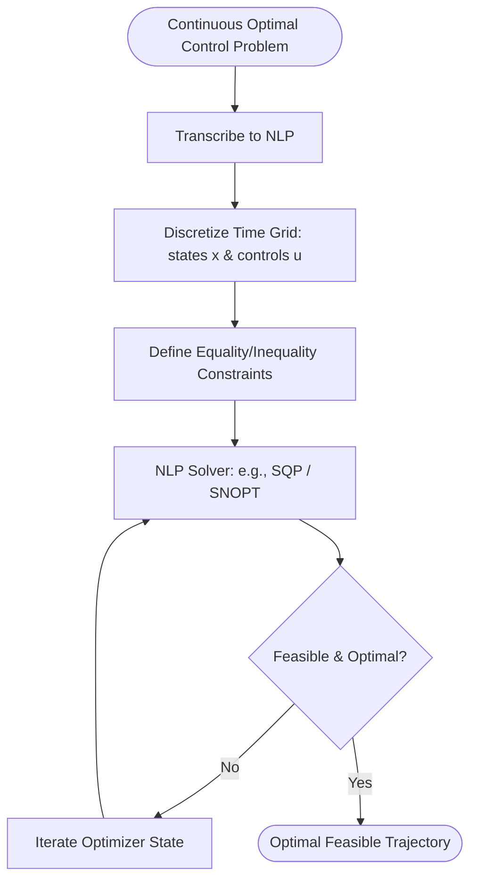

# Classical Numerical Solvers in Trajectory Optimization 🧭

Trajectory optimization began with classical numerical solvers. In the pre-deep learning era, optimal control problems were formulated using mathematical calculus and solved using numerical optimization techniques.

## 📋 Core Concepts

Traditional trajectory optimization solves a constrained optimal control problem:

$$\min_{u(t)} J = \Phi(x(t_f), t_f) + \int_{t_0}^{t_f} L(x(t), u(t), t) dt$$

subject to:
- System Dynamics: $\dot{x}(t) = f(x(t), u(t), t)$
- Boundary Conditions: $\psi(x(t_0), x(t_f), t_0, t_f) = 0$
- Path Constraints: $g(x(t), u(t), t) \le 0$

### Transcription Methods
1. **Direct Transcription:** Discretizes both states and control inputs across a time grid.
2. **Collocation Methods:** Fits polynomials to trajectory segments and enforces dynamics constraints at specific collocation points.
3. **Shooting Methods:** Parameterizes only control inputs and integrates the dynamics forward.

---

## 📊 Workflow Diagram

---

## ⚠️ Key Limitations

- **Model Dependency:** Requires a perfect, analytical, differentiable physics model.
- **High Latency:** Solving large nonlinear programming (NLP) problems is computationally heavy and unsuitable for high-frequency feedback loops.
- **Local Minima:** Highly sensitive to the initial guess, often getting stuck in sub-optimal local basins.

---

## 📚 References
- Hargraves, C. R., & Paris, S. W. (1987). *Direct Trajectory Optimization Using Nonlinear Programming and Collocation*. Journal of Guidance, Control, and Dynamics. [AIAA Link](https://arc.aiaa.org/doi/10.2514/3.20223)
