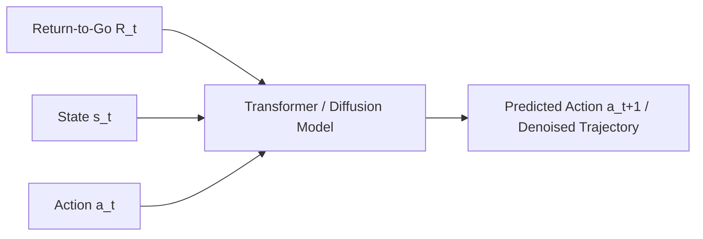

# Deep Neural & Generative Sequence Era 🤖

The modern state-of-the-art framework merges trajectory optimization with deep generative models. Rather than relying on step-by-step calculus loops, trajectory planning is reframed as a sequence modeling or data generation task.

## 📋 Core Concepts

In this era, trajectories are treated as sequences of tokens, similar to sentences in natural language processing or pixels in generative image modeling.

### Key Paradigms
1. **Decision Transformers (DT):** Reframes reinforcement learning as sequence modeling. Given a desired Return-to-Go, DT predicts the sequence of actions that achieves it using a causal Transformer.
2. **Diffusion Policies (Diffuser):** Replicates the process of image diffusion. Starts with a random Gaussian noise vector representing the path and iteratively refines it to generate smooth, obstacle-free trajectories.

---

## 📊 Sequence Modeling Architecture

---

## ⚠️ Challenges & Pros

- **Pros:** Instant inference (feedforward pass), excellent generalization from massive datasets, handles multi-modal trajectories naturally.
- **Cons:** Lack of safety guarantees, potential out-of-distribution failure, and high computation/memory footprint during training.

---

## 📚 References
- Chen, L., Lu, K., Rajeswaran, A., Lee, K., Grover, A., Laskin, M., Abbeel, P., Srinivas, A., & Mordatch, I. (2021). *Decision Transformer: Reinforcement Learning via Sequence Modeling*. [arXiv Link](https://arxiv.org/abs/2106.01345)
