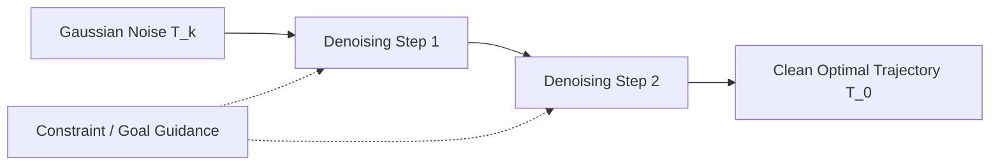

# Diffusion-Based Trajectory Policy (Diffuser) 🌊

Diffusion-based planning reframes trajectory optimization as a iterative denoising process. Trajectories are generated globally by molding random noise into optimal paths.

## 📋 Core Concepts

Rather than learning step-by-step action policies, a Diffuser model learns to denoise complete trajectory sequences:

1. **Initialization:** Start with a trajectory matrix representing pure Gaussian noise over a window of length $T$.
2. **Reverse Diffusion:** Apply a learned denoising network (e.g., U-Net) to step-by-step remove noise from the trajectory.
3. **Conditioning / Guidance:** Guide the denoising process using classifiers or value functions to ensure the final trajectory avoids obstacles and maximizes rewards.

---

## 📊 Denoising Trajectory Process

---

## ⚠️ Key Trade-offs

- **Pros:** Capable of representing multi-modal distributions (e.g., passing an obstacle on the left or right). Generates highly smooth global trajectories.
- **Cons:** High computational latency due to the iterative nature of diffusion (requiring multiple neural network evaluations per planning step).

---

## 📚 References
- Janner, M., Du, Y., Tenenbaum, J. B., & Levine, S. (2022). *Planning with Diffusion for Flexible Behavior Synthesis*. ICML. [arXiv Link](https://arxiv.org/abs/2205.09991)
