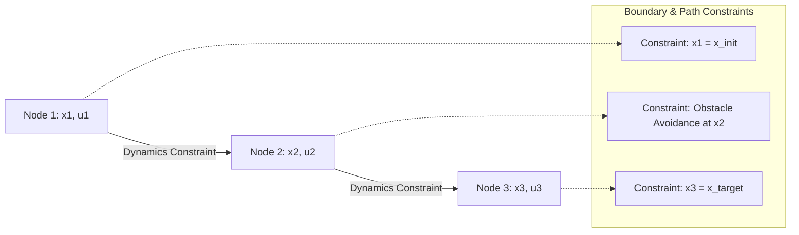

# Direct Collocation & Transcription Methods 🔲

Direct Collocation methods discretize both the state and control variables simultaneously over a chronological grid, transforming the optimal control problem into a large-scale, sparse Nonlinear Programming (NLP) problem.

## 📋 Core Concepts

Rather than integrating the dynamics forward sequentially (as in shooting methods), direct collocation treats the values of states and controls at discrete grid points (collocation nodes) as independent decision variables:

1. The timeline is split into $N$ segments.
2. The state $x_i$ and control $u_i$ at each node $i$ are decision variables.
3. System dynamics are enforced as equality constraints at the center of each segment (using integration schemes like Hermite-Simpson or Trapezoidal collocation).
4. Path constraints (e.g. obstacle avoidance limits) are enforced directly at each node.

---

## 📊 Node Layout and Constraints

---

## ⚠️ Key Trade-offs

- **Pros:** Excellent numerical stability. Handles complex path and boundary constraints (like obstacle grids) very efficiently.
- **Cons:** Results in a very large optimization problem with thousands of decision variables and constraints, requiring sparse NLP solvers (e.g. IPOPT, SNOPT).

---

## 📚 References
- Hargraves, C. R., & Paris, S. W. (1987). *Direct Trajectory Optimization Using Nonlinear Programming and Collocation*. Journal of Guidance, Control, and Dynamics. [AIAA Link](https://arc.aiaa.org/doi/10.2514/3.20223)
