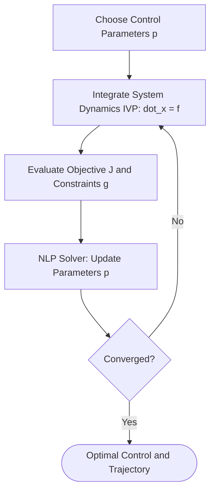

# Direct Shooting Methods 🏹

Direct Shooting (specifically Single Shooting) methods convert a continuous optimal control problem into a finite-dimensional Nonlinear Programming (NLP) problem by parameterizing *only* the control variables.

## 📋 Core Concepts

In a direct shooting setup:
1. The continuous control input $u(t)$ is discretized or parameterized using parameters $p$ (e.g., piecewise constant or piecewise polynomial parameters).
2. Given $p$, an Initial Value Problem (IVP) solver integrates the system dynamics forward in time to compute the state trajectory $x(t)$.
3. The objective function and path constraints are evaluated based on this simulated trajectory.
4. An NLP solver updates the control parameters $p$ to minimize the cost while satisfying boundaries.

---

## 📊 Process Loop

---

## ⚠️ Key Trade-offs

- **Pros:** Small optimization problem size (only control parameters are decision variables). Easy to implement since standard ODE solvers can be used directly.
- **Cons:** Highly sensitive to initial parameters. Errors in early integration steps cascade, making the trajectory "shoot" far off-target, leading to numerical instability in long horizons (chaotic dynamics).

---

## 📚 References
- Hicks, G. A., & Ray, W. H. (1971). *Approximation methods for optimal control synthesis*. The Canadian Journal of Chemical Engineering. [Wiley Link](https://doi.org/10.1002/cjce.5450490418)
