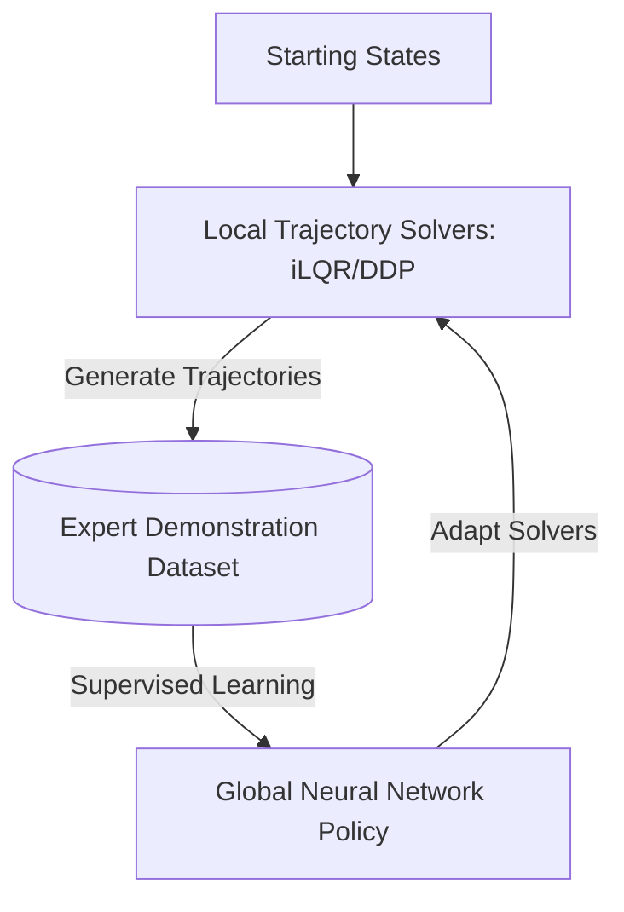

# Guided Policy Search (GPS) 🧭

Guided Policy Search bridges the gap between classical trajectory optimization and deep reinforcement learning. It uses local trajectory optimization to guide the training of a global policy.

## 📋 Core Concepts

Rather than training a neural network policy directly from scratch using high-variance reinforcement learning, GPS decomposes the problem:

1. **Local Trajectory Optimization:** Apply classical, fast optimal control algorithms (such as Differential Dynamic Programming (DDP) or iterative LQR) from various starting states to find locally optimal trajectories.
2. **Supervised Distillation:** Treat these optimized trajectories as expert demonstrations. Train the global neural network policy using supervised learning (behavioral cloning) to reproduce these trajectories.
3. **Co-optimization:** Jointly optimize the trajectories and the policy to ensure the trajectories are realistic for the policy to execute and the policy generalises well.

---

## 📊 GPS Loop

---

## ⚠️ Key Trade-offs

- **Pros:** Extremely sample-efficient compared to model-free RL. Leverages physics-based solvers to simplify the search space.
- **Cons:** Requires a model or simulator that supports trajectory optimization (e.g. differentiable dynamics or local approximations).

---

## 📚 References
- Levine, S., & Koltun, V. (2013). *Guided Policy Search*. ICML. [PMLR Link](http://proceedings.mlr.press/v28/levine13.html)
