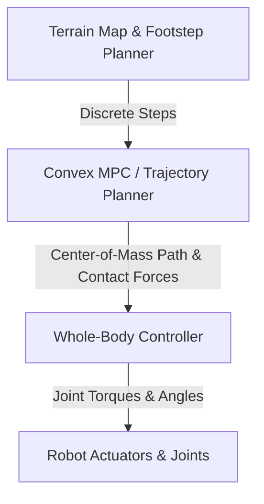

# Spatio-Temporal Control for Humanoid Robotics 🤖

Locomotion control in advanced bipedal humanoid robotics requires calculating dynamically feasible trajectories for high-dimensional floating-base systems under contact constraints.

## 📋 Core Concepts

Legged robots must maintain balance while traversing uneven or volatile environments. Trajectory planning is typically structured hierarchically:

1. **Footstep Planner:** Chooses discrete contact locations on the ground.
2. **Simplified MPC Solver:** Uses reduced-order models (such as the Single Rigid Body Model or Linear Inverted Pendulum Model) to calculate optimal Ground Reaction Forces (GRFs) and Center of Mass (CoM) trajectories over a finite horizon.
3. **Whole-Body Controller (WBC):** Maps the optimized CoM paths and GRFs to joint torques, resolving full-body dynamics and joint boundaries.

---

## 📊 Locomotion Controller Hierarchy

---

## 📚 References
- Kuindersma, S., Deits, R., Fallon, M., Valenzuela, A., Dai, H., Permenter, F., Cooley, T., & Tedrake, R. (2016). *Optimization-based locomotion planning, estimation, and control design for the atlas humanoid robot*. Autonomous Robots. [Springer Link](https://doi.org/10.1007/s10514-015-9479-3)
