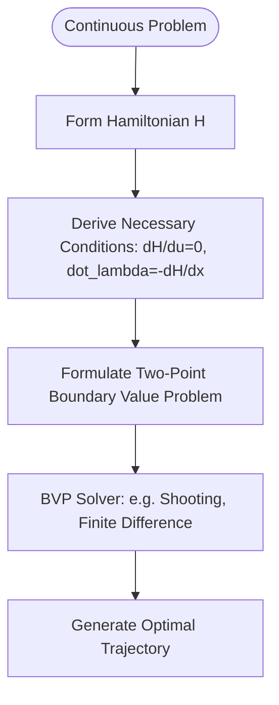

# Indirect Methods in Trajectory Optimization 🎯

Indirect methods solve optimal control problems by converting them into boundary value problems (BVPs) using the necessary conditions of optimality. This approach is conceptually described as "optimize then discretize."

## 📋 Core Concepts

Indirect methods rely on the **Calculus of Variations** and **Pontryagin's Minimum Principle** (PMP).

### Mathematical Formulation
1. Define the Hamiltonian:
   $$H(x, u, \lambda, t) = L(x, u, t) + \lambda^T f(x, u, t)$$
   where $\lambda$ represents the costate variables (adjoint vector).
2. Optimality condition:
   $$\frac{\partial H}{\partial u} = 0 \implies u^* = \arg\min_u H$$
3. Costate dynamics (adjoint equations):
   $$\dot{\lambda} = -\frac{\partial H}{\partial x}$$
4. Solve the resulting Two-Point Boundary Value Problem (TPBVP) with boundary conditions at $t_0$ and $t_f$.

---

## 📊 Solution Flowchart

---

## ⚠️ Pros & Cons

- **Pros:** Highly accurate solutions that mathematically satisfy optimality conditions.
- **Cons:** Extremely narrow domain of convergence; requiring a highly accurate initial guess for the costates ($\lambda$), which lack physical meaning and are difficult to estimate. Fails on non-smooth or complex path constraints.

---

## 📚 References
- Boltyanskii, V. G., Gamkrelidze, R. V., Mishchenko, E. F., & Pontryagin, L. S. (1962). *The Mathematical Theory of Optimal Processes*. Interscience Publishers. [Google Books Link](https://books.google.com/books?id=0s5QAAAAMAAJ)
