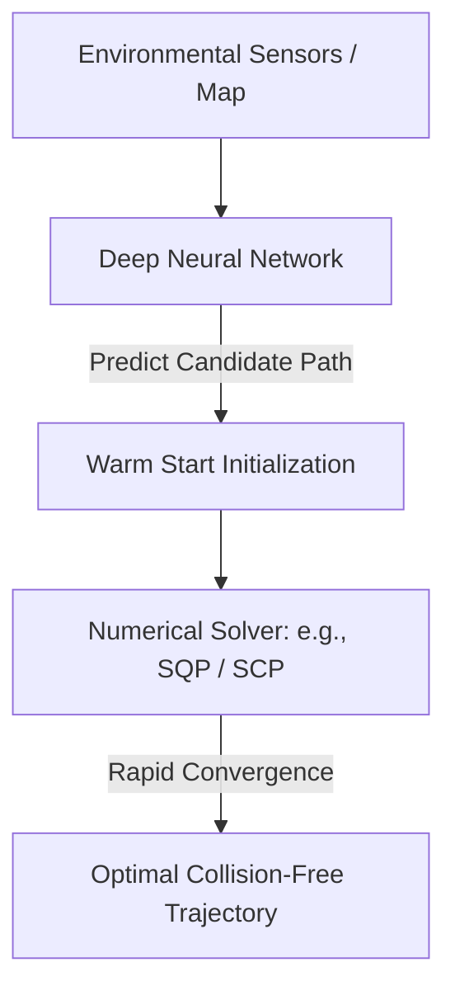

# Local Minima & Neural Warm-Starting ⚡

Solving trajectory optimization problems in complex, cluttered environments is highly non-convex. Traditional numerical solvers easily get trapped in sub-optimal local minima.

## 📋 Core Concepts

In environments with dynamic obstacles, the optimization landscape is filled with "valleys" (local minima). If a solver is initialized with a poor starting guess, it may fail to find a path or choose a highly inefficient route.

### Neural Warm-Starting
To mitigate this, a deep convolutional network or vision-language model is trained to predict coarse, near-optimal trajectories based on the visual or spatial representation of the scene. This prediction is used to seed the mathematical solver:

1. **Scene Evaluation:** A neural network processes the environmental map.
2. **Warm Start Prediction:** The network outputs a candidate trajectory.
3. **Solver Optimization:** The numerical solver uses this candidate as its starting initialization ($x_0, u_0$) and refines it.

---

## 📊 Warm-Starting Pipeline

---

## ⚠️ Advantages

- **Drastic Latency Reduction:** Reduces the number of solver iterations needed for convergence.
- **Improved Feasibility:** Avoids infeasible basins or local minima freezing.

---

## 📚 References
- Banerjee, S., Lew, T., Pavone, M. (2020). *Learning-based warm-starting for fast sequential convex programming and trajectory optimization*. IEEE Aerospace Conference. [IEEE Link](https://ieeexplore.ieee.org/document/9172773)
