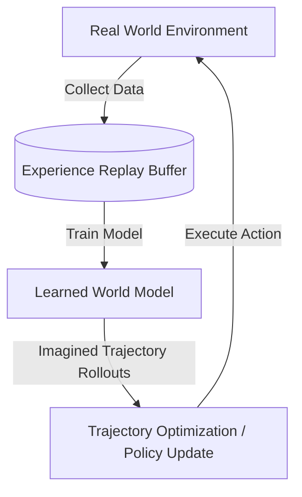

# Model-Based Reinforcement Learning (MBRL) 🌍

Model-Based Reinforcement Learning integrates trajectory planning with learned environment models (World Models), allowing the agent to optimize trajectories through simulated rollouts.

## 📋 Core Concepts

In MBRL:
1. **World Model Learning:** The agent gathers experience from the physical world and trains a transition model $s_{t+1} = \hat{f}(s_t, a_t)$ and reward predictor $r_t = \hat{R}(s_t, a_t)$.
2. **Imagination / Rollouts:** The agent performs trajectory optimization (planning) entirely inside the learned latent or state space of the World Model.
3. **Policy Improvement:** The gradients of the simulated trajectories are used to train a policy network, minimizing physical interactions and reducing sample complexity.

---

## 📊 MBRL Architecture Loop

---

## ⚠️ Key Trade-offs

- **Pros:** High sample efficiency; safe optimization without risky physical exploration.
- **Cons:** **Model Exploitation:** The agent can find policies that exploit inaccuracies (errors) in the learned World Model, leading to poor performance in the real world.

---

## 📚 References
- Ha, D., & Schmidhuber, J. (2018). *Recurrent World Models Facilitate Policy Evolution*. NeurIPS. [arXiv Link](https://arxiv.org/abs/1803.10122)
