# Model Predictive Control (MPC) & Receding Horizon Optimization 🔄

Model Predictive Control (MPC), also referred to as Receding Horizon Control (RHC), shifted the paradigm from calculating a static global path offline to continuously resolving trajectory segments online in real-time.

## 📋 Core Concepts

Rather than executing a single trajectory calculated at the beginning, MPC repeatedly solves an optimal control problem over a finite future horizon $T_p$:

1. Ingest the current state measurement $x(t)$.
2. Solve the optimal control problem over $[t, t+T_p]$.
3. Apply *only the first step* of the calculated control sequence $u^*(t)$.
4. Shift the time horizon forward and repeat the optimization at the next sample interval.

This Receding Horizon strategy introduces feedback, allowing the system to compensate for model mismatches, unmodeled dynamics, and external disturbances.

---

## 📊 Receding Horizon Diagram

```mermaid
gantt
    title Receding Horizon Window Progression
    dateFormat  X
    axisFormat %s
    
    section Horizon at t=0
    Optimize [0, Tp]      :active, h1, 0, 10
    Execute first step    :crit, exec1, 0, 2
    
    section Horizon at t=1
    Optimize [1, 1+Tp]    :active, h2, 2, 12
    Execute first step    :crit, exec2, 2, 4
    
    section Horizon at t=2
    Optimize [2, 2+Tp]    :active, h3, 4, 14
    Execute first step    :crit, exec3, 4, 6
```

---

## ⚠️ Challenges and Trade-offs

- **Computation Bottleneck:** Solving an optimization problem at every time step requires fast computation, limiting the complexity of system dynamics and the length of the prediction horizon.
- **Feasibility & Stability:** Proving recursive feasibility (guaranteeing a solution exists at the next step) and closed-loop stability often requires complex terminal costs or terminal constraints.

---

## 📚 References
- Richalet, J., Rault, A., Testud, J. L., & Papon, J. (1978). *Model predictive heuristic control: Applications to industrial processes*. Automatica. [ScienceDirect Link](https://doi.org/10.1016/0005-1098(78)90001-8)
